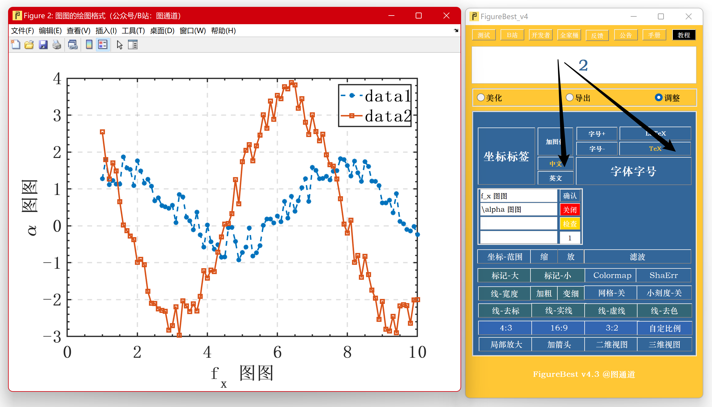

# FigureBest v4 帮助文档 Documentation of FigureBest v4

## 1. 简介 Brief introduction

## 2. 常见问题 General questions

### 如何对Simulink模块的图进行美化？

处理Simulink图的核心思想是**重绘**（RePlot），即，一键绘制一份能够被FB处理的副本。FB不一定能美化所有工具箱的图，因为各个工具箱差别巨大，以**Scope**图为例：

- 第1步：从工具箱导出.fig图，各个工具箱差别很大，但是基本都有该功能;

- 第2步：使用FB上的**RePlot**按钮自动生成一份FB可以处理的副本（在FB4.3上位置如图所示）;

- 第3步：输入对应的左上角.fig编号进行美化，像普通的.fig图一样;

### 为什么点美化后标签中中文变成了乱码或者方框？

美化是针对SCI英文环境的图，所以美化的时候无论用户设置什么字体，都会修改为**Times**字体，一般来讲这是高效且直接的。如果原来有中文字体，中文字体与Times不兼容，会发生冲突，变成方块或者乱码，只要点击**中文**按钮，或者自己修改成中文字体即可恢复。（注意：MATLAB一个文字框只能包含一种字体，既有英文的Times又有中文是做不到的;例外是将英文放在**tex**环境中）

### 公式问题与中英文混用

FB美化时会自动采用**latex**解释器而非**tex**解释器，它们的差别请查看MATLAB官方的帮助文档[Interpreter](https://ww2.mathworks.cn/help/releases/R2019b/matlab/ref/matlab.graphics.shape.textbox-properties.html?#prop_Interpreter)，在这里简单示范一下，帮助已经了解latex语法的朋友快速上手FB。

- 在latex样式下，需要美元符号申明环境;且latex语法会覆盖MATLAB命令，表现为字体需要用latex语法设置;且latex样式下下不支持中文;

- 在tex样式下，中英文可以混用，但不能有美元符号；

这里图图提供一个在线的latex转换网站，[latexlive](https://www.latexlive.com/##)。

### 3. 功能3

### 4. 功能4

